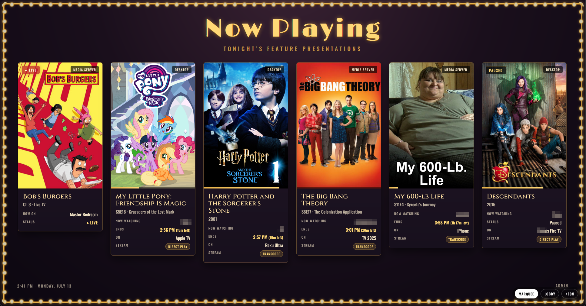

# 🎬 Streaming Marquee

A movie-theater style **"Now Playing"** screen for your media servers. It shows the
poster art, who's watching, and the time each stream will finish — all rendered as an
old-school (but good-looking) theater marquee.



It supports three backends, and you can mix as many of each as you like:

- **[Tautulli](https://tautulli.com)** — for Plex servers.
- **[Jellystat](https://github.com/CyferShepard/Jellystat)** — for Jellyfin servers.
- **[Channels DVR](https://getchannels.com/)** — for live TV.

> **About Channels DVR:** it reports which channel is being watched and the device.
> The app enriches this from the DVR's guide, so live streams show the **current
> program and its poster** (pulled from the channel's "on now" guide data) with a
> **LIVE** badge and the watching device. If a channel has no guide art, it falls
> back to a channel-name LIVE tile. There are no per-user accounts and no end time
> for live TV.

Three switchable themes are included:

- **Marquee** — 1930s Art-Deco theater with a bulb-lit border.
- **Lobby** — mid-century framed lobby-card poster wall.
- **Neon** — 1950s neon drive-in signage.

## Requirements

- **Node.js 18 or newer** (uses the built-in `fetch`). No `npm install` needed —
  the app has zero dependencies and uses only Node core modules.

Check your version:

```bash
node --version
```

## Running it

From inside this folder:

```bash
node server.js
```

On first launch it picks a **random high port** (in the 49200–65500 range, chosen to
avoid collisions with other services) and saves it to `config.json`. Every restart
after that reuses the same port, so your URL stays stable. The port is printed on
startup:

```
==========================================================
  🎬  Streaming Marquee is now showing
==========================================================
  Now Playing screen : http://localhost:53072/
  Admin backend      : http://localhost:53072/admin
```

Open the **Now Playing screen** in any browser on your machine, or reach it from
another device on your LAN at `http://<your-machine-ip>:<port>/`.

## First-time setup

1. Open the **Admin** page (link at the bottom-right of the marquee, or `/admin`).
2. Add an instance:
   - **Backend** — pick **Tautulli (Plex)** or **Jellystat (Jellyfin)**. The default
     port fills in automatically (`8181` for Tautulli, `3000` for Jellystat).
   - **Host / IP** and **Port**.
   - **API key**:
     - *Tautulli:* Settings → Web Interface → API key.
     - *Jellystat:* Settings → API Keys → create a key.
     - *Channels DVR:* none needed on your LAN — the field is disabled for it.
   - Tick **Use HTTPS** if the server is served over TLS (self-signed certs are
     accepted).
3. Click **Test connection** to confirm, then **Add instance**.
4. Repeat for as many instances as you like, mixing Tautulli and Jellystat freely —
   the marquee merges the now-playing activity from all of them.

> **Upgrading from a Tautulli-only version?** Your existing instances carry over
> automatically. On first launch the app backfills a `type: "tautulli"` field on any
> older entries, so nothing needs to be re-added.
5. Optionally set the default theme and refresh interval under **Display settings**.

You can also switch themes on the fly using the buttons in the bottom-right of the
marquee screen; the choice is saved as the new default.

## Keeping it running

To have it run continuously / restart on boot, use whatever you already use for
Node services. A couple of common options:

**pm2**
```bash
npm install -g pm2
pm2 start server.js --name streaming-marquee
pm2 save
```

**systemd** (Linux) — create `/etc/systemd/system/streaming-marquee.service`:
```ini
[Unit]
Description=Streaming Marquee
After=network.target

[Service]
WorkingDirectory=/path/to/streaming-marquee
ExecStart=/usr/bin/node server.js
Restart=always
User=youruser

[Install]
WantedBy=multi-user.target
```
Then `sudo systemctl enable --now streaming-marquee`.

## How it works

- **`server.js`** — a small pure-Node HTTP server. It:
  - serves the front-end from `public/`,
  - aggregates now-playing activity from every configured instance — Tautulli's
    `get_activity`, Jellystat's `/proxy/getSessions`, and Channels DVR's `/dvr`
    activity map (the `Watching …` entries),
  - computes each stream's finish time from its remaining runtime (Tautulli reports
    milliseconds; Jellystat/Jellyfin reports 100-ns "ticks", which are converted),
  - proxies poster artwork through `/img` (Tautulli's `pms_image_proxy` or Jellystat's
    image proxy) so your API keys never reach the browser and there are no CORS /
    mixed-content issues.
- **`config.json`** — created automatically. Holds the persisted port, theme,
  refresh interval, and your list of instances (with API keys). Keep it private.

## Tuning Channels DVR parsing

Channels DVR's activity strings and guide JSON aren't strictly documented, so the app
parses them defensively (activity: anything containing "Watching"; guide: the current
airing's title + image from `/devices/<id>/guide/now`). If a live stream shows up with
an odd title, the wrong device, or a missing poster, open this URL in your browser to
see the raw data the server received and how it was parsed:

```
http://localhost:<port>/api/debug?i=<instance-id>
```

It returns the raw `activity` strings, the `devices` list, the resolved `guideMap`
(channel → program + image), and the final `parsed` items. Share that and the field
mapping in `parseChannelsActivity()` / `mergeGuideNow()` can be adjusted to your
server's exact shape. (The instance id is shown in `config.json`.)

## Admin password

The admin page can be password protected (optional). The **Security** card has a
**toggle** to require a password, plus a box to set or change it at any time:

- **Enable:** type a password and click **Save** (or flip the toggle on, then Save).
  You're logged in immediately and a login is required from then on.
- **Change:** while logged in, just type a new password and click **Save** — no need
  to re-enter the old one.
- **Disable:** flip the toggle off (confirms first). The page becomes open again.
- **Log out** ends your session without disabling the password.

The password is stored **salted + hashed** (scrypt) in `config.json` under `adminAuth`
— never in plain text. Sessions are cookie-based and reset when the server restarts
(you'll just log in again). Forgot the password? Delete the `adminAuth` key from
`config.json` and restart; the page reverts to open + "set password".

Only the admin actions are gated. The public marquee (`/`), the now-playing feed, and
poster images stay open so the display works without logging in.

## Notes on security

API keys are stored in `config.json` (that's how Tautulli/Jellystat need them) and are
masked in the admin UI, but anyone with filesystem access to the box could read them.
Keep the server bound to your trusted LAN and firewalled off from the public internet.
Channels DVR needs no key. Every config save first writes a timestamped backup into
`.config-backups/` so an accidental change can be rolled back.

## Files

```
streaming-marquee/
├── server.js            # the server (no dependencies)
├── package.json
├── config.json          # auto-generated; your instances + settings
├── README.md
└── public/
    ├── index.html       # the Now Playing marquee
    ├── app.js           # marquee front-end logic
    ├── themes.css       # the three themes
    ├── admin.html       # admin backend
    └── admin.js         # admin logic
```
